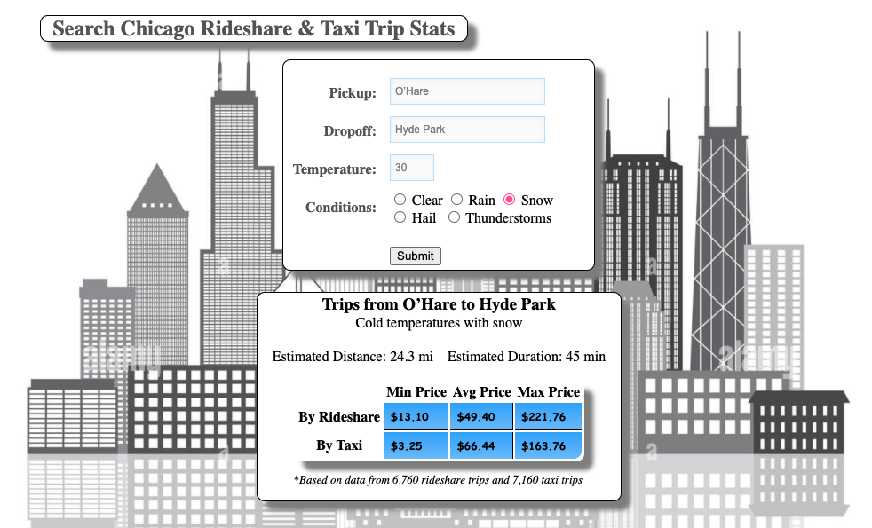

# MPCS-53014 Final Project: Chicago Taxi & Rideshare Trips

## Overview
This repo contains all scripts and source code for my Chicago Taxi & Rideshare Trip application. The application leverages Chicago Data Portal's Taxi dataset, as well as the Transportation Network (Rideshare) dataset along with weather data for Chicago, IL to provide insight into the pricing of trips in relation to the weather. The taxi trip dataset dates back to 2013 and includes over 140 million trips, while the Rideshare dataset includes over 150 million trips dating back to 2018. As shown below, the key functionality is the ability to access pricing, distance, and duration statistics for a given route and specified weather conditions. A route is defined by a pickup and dropoff Community Area code. (Note: Chicago currently has 77 Community Areas)



While there is no realtime data feed available for Chicago's Taxi and Transportation Network data, I did implement a web form for user submission of new trips in order to simulate a realtime feed. This realtime data allowed me to develop a speed layer for this application.


## Running the Application

The web application has been deployed using CodeDeploy to our load balanced web servers and can be accessed at the links below:
- [Trip Stats](http://manita-lb-1574432182.us-east-2.elb.amazonaws.com/trip-stats.html)
- [Submit New Trip](http://manita-lb-1574432182.us-east-2.elb.amazonaws.com/submit-trips.html)

The speed layer can be started by running the commands below from the EMR cluster.
```bash
cd /manita/speed-layer-trips/target

spark-submit --master local[2] --driver-java-options "-Dlog4j.configuration=file:///home/hadoop/ss.log4j.properties" --class StreamTrips uber-speed-layer-trips-1.0-SNAPSHOT.jar b-2.mpcs53014-kafka.198nfg.c7.kafka.us-east-2.amazonaws.com:9092,b-1.mpcs53014-kafka.198nfg.c7.kafka.us-east-2.amazonaws.com:9092
```
Note that the speed layer must be running in order to use the new trip submission form.

## Design & Implementation Details

### Data Ingestion

See the `ingest-data` directory for my data ingestion scripts. I downloaded the Taxi and Rideshare datasets (60+ GB each) from Chicago Data Portal in CSV format and put them into HDFS. I also created a lookup CSV file with the names and IDs of Chicago's 77 community areas to use in mapping the trip data.

I also leveraged the `hdfs-ingest-weather` program and Thrift SerDe from earlier in this course to ingest 2021 data from NOAA specifically for Chicago. I used data only for station 725350 (located in central Chicago) as a simplification here. For weather data prior to 2021, I relied on the existing weather table from the course.

### Data Lake & Batch Views

My data lake contains 2 Hive tables of raw data - one for taxi trips and one for rideshare trips. I leveraged the OpenCSVSerde to serialize these datasets, and I did not do any transformations to follow the best practice of keeping the data lake as raw as possible. I did however eliminate rows that were missing a trip pickup location, dropoff location, or price. These fields could be missing due to bad data, formatting issues, or if the pickup or dropoff locations are outside of Chicago's 77 community areas. Since my project focuses only on trips within the city limits, I was okay with dropping these records.

Next, I created a raw community areas table in Hive from `batch-layer/community_areas.csv`, as well as a Hive table to hold raw weather data. This table is identical to the class weather table, but I have limited the rows to only station 725350. I then created a transformed Hive view that included a subset of relevant fields for both taxi and rideshare trips, and I joined these with the community areas table to convert pickup/dropoff community area IDs to names. The next step was to join with the weather table. I was interested in temperature ranges and conditions (such as rain, snow, thunder, etc.) and I added calculated fields for both of these.

Lastly, I created a batch view that aggregated trip stats grouped by route, weather (both temperature and conditions) for both taxi and rideshare. This Hive table is called `manita_trips_by_route_and_weather`. All intermediate tables and queries can be found in the `batch-layer` directory.


### Serving Layer

I created an HBase table as part of my serving layer to provide quick lookup for trip stats by weather, route, and trip type. I decided to key the data on `pickup_area + dropoff_area + weather` to align with the web application functionality. I created 2 families, one for taxi and one for rideshare. I made this decision to avoid having to make 2 separate API calls from the front end in order to get stats for both taxi and rideshare. I wanted to quickly be able to get both sets of statistics at once. The Hbase table is called `manita_trip_stats_by_route_and_weather` and the script can be found in `batch-layer/hbase_trip_stats_by_weather_and_route.hql`.

As a workaround to encoding issues with floating point numbers, I scaled up fields with floating point numbers to bigint/longs by multiplying them by 100. I divide these values on the frontend before displaying to the user.


### Speed Layer

My speed layer is based on the `speed-layer-flights` archetype and can be found in the `speed-layer-trips` directory. My `speed-layer-trips` program subscribes to a Kafka topic called `manita_trips` that I created for this application. The web application writes trip data to the topic when a user submits a new trip to be consumed by the speed layer. When a new trip is read from the kafka topic, the speed layer increments the total trips, price, distance, and duration fields of the Hbase table. It also uses an Hbase get and put in order to check and update the minimum and maximum price fields.

I decided not to implement a speed layer for my weather data since the Chicago weather can be fetched with a single API request which is likely more efficient than storing and fetching weather data for one station in a lookup table. I leverage the current weather API at `openweathermap.org` for this purpose. Upon starting, the speed layer fetches the weather and stores it in memory. Whenever a new trip is read from the Kafka topic, we check how long ago the existing weather report was fetched. If it has been longer than 5 minutes, the weather is fetched again. If not, we use the latest weather to update the Hbase table as described above.


### Web App

My web app source code can be found in the `app` directory. If needed, it can be run from the single web server using the below commands:
```bash
cd home/manita/final-project
npm install
node app.js 3013 172.31.39.49 8070 mpcs53014-kafka.198nfg.c7.kafka.us-east-2.amazonaws.com:9092
```

The app can then be viewed on port 3013 [http://ec2-52-14-115-151.us-east-2.compute.amazonaws.com:3013/trip-stats.html]
